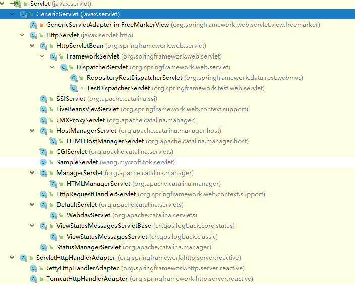

# servlet

本文完全基于自我理解，简单为主

## 是什么

`servlet`是一套`web`服务器标准，服务器软件遵守`servlet`接口，那么程序员也基于`servlet`接口开发，这样有利于在不同服务器软件迁移，即使某个服务器软件不好用了，或者因为某些原因不能用了，那么就算更换服务器软件，也能减少工作。

目前最常用的都是`tomcat`服务器软件，虽然还有如`jetty`, `undertow`的`servlet`容器，但是几乎都在使用`tomcat`作为`servlet`容器。

## 用来做什么

`servlet`定义了`web`服务器的一个标准，遵循这个标准的服务器软件就是`servlet`容器。

作为程序员来说，遵守`servlet`接口进行开发就行。

## 怎么用

`servlet`是一个接口，在`javax.servlet-api-***.jar`中，`***`是版本号，目前是`4.0.1`, 其完整路径是`javax.servlet.Servlet`, 其中有5个接口，如下
```java
public interface Servlet {
    public void init(ServletConfig config) throws ServletException;
    public ServletConfig getServletConfig();
    public void service(ServletRequest req, ServletResponse res)
            throws ServletException, IOException;
    public String getServletInfo();
    public void destroy();
}
```
每个接口的作用我就不说了，可以阅读源码，非常详细。

虽然可以使用实现`Servlet`接口的方式进行编码，但是这样工作量实在不少，而且现在数据交互，几乎都是使用`HTTP`协议，所以通常都会使用到`javax.servlet.http.HttpServlet`来处理`HTTP`请求, 它继承自`javax.servlet.GenericServlet`, 间接实现了`Servlet`接口。在`Spring Boot`下，查看其继承接口如下


### `HTTP`

也从上面的结构图中可以看出来，几乎所有的`Servlet`实现类都继承自`HttpServlet`, 包括`Spring Boot`的`DispatcherServlet`.

可以这样说，数据传输使用`HTTP`协议，那我们都是面向`HTTP`编程的。如实现`redirect`, `cookie`, `session`, `cache`, `compress`, 都是基于`HTTP`协议来实现的。

## 其他细节

